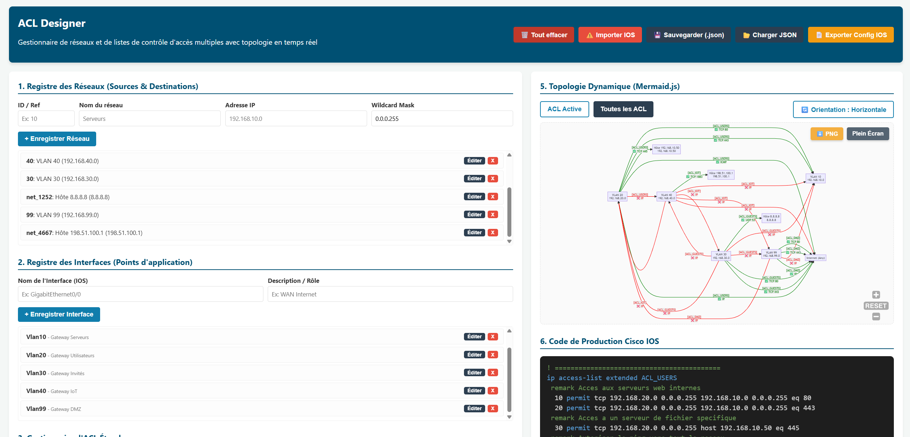

# ACL Designer
## Table des matières

- [Fonctionnalités Principales](#fonctionnalités-principales)
- [Fonctionnalités Avancées de Sécurité](#fonctionnalités-avancées-de-sécurité)
- [Utilisation (Zéro Installation)](#utilisation-zéro-installation)
- [Outils & Technologies Utilisées](#outils--technologies-utilisées)
- [Comment utiliser la Rétro-conception (Import IOS) ?](#comment-utiliser-la-rétro-conception-import-ios-)
- [Note sur l'IA](#note-sur-lia)

--- 

**ACL Designer** est un outil web interactif tout-en-un (zéro installation) conçu pour simplifier la création, la gestion et la visualisation de Listes de Contrôle d'Accès (ACL) étendues pour les équipements Cisco IOS. 

**[Lien vers l'outils](https://hoferlukaslh.github.io/ACL-Designer/)**

Fini les erreurs de syntaxe et les plans réseau brouillons : dessinez vos règles, l'outil génère le code Cisco et cartographie votre topologie en temps réel !



---


## Fonctionnalités Principales

* **Registre de Réseaux & VLANs :** Déclarez facilement vos réseaux (ID, Nom, IP, Masque générique/Wildcard).
* **Gestionnaire Multi-ACL :** Créez plusieurs ACLs, assignez-les à des VLANs spécifiques et définissez leur direction (IN/OUT).
* **Génération de configuration IOS :** L'outil compile en temps réel vos règles en syntaxe Cisco IOS valide (`ip access-list extended`, `permit/deny`, `interface Vlan`, `ip access-group`).
* **Cartographie Topologique Dynamique :** Visualisez instantanément l'impact de vos règles grâce à la génération de graphes **Mermaid.js**.
  * Affichage des règles d'une ACL spécifique ou de l'ensemble du projet.
  * Orientation horizontale (LR) ou verticale (TD).
  * **Navigation fluide :** Zoom à la molette, déplacement (pan) et mode Plein Écran intégrés.
  * **Exportation PNG :** Téléchargez votre topologie réseau en image HD d'un simple clic.
* **Rétro-conception IOS (Reverse Engineering) :** Collez un extrait de `show running-config` (ACLs et interfaces). L'outil l'analyse, recrée les réseaux manquants et dessine la carte topologique automatiquement !
* **Sauvegarde locale & JSON :** Vos données sont sauvegardées dans votre navigateur, avec possibilité d'exporter/importer des fichiers `.json`.

## Fonctionnalités Avancées de Sécurité
Cette version intègre des mécanismes d'audit inspirés des exigences réelles de production Cisco IOS :

- Détection du Rule Shadowing : L'outil vous alerte si une règle de séquence supérieure est rendue inutile par une règle plus large placée au-dessus.
- Alerte Implicit Deny : Notification visuelle immédiate si une ACL ne contient que des règles `deny`, risquant de provoquer une coupure totale de service.
- Validation Binaire des Masques : Calculateur intégré vérifiant la cohérence mathématique entre vos adresses IP et vos masques Wildcards.
- Support complet L4 & ICMP : Gestion native des types de messages ICMP (RFC 792) et des drapeaux TCP (`established`), ainsi que du `logging` pour l'auditabilité.

---

## Utilisation (Zéro Installation)

L'application est un outil statique autonome. Aucun backend, base de données ou serveur lourd n'est requis pour son fonctionnement.
1. Téléchargez l'archive contenant index.html, script.js et style.css.

2. Ouvrez index.html dans votre navigateur web (Chrome, Firefox, Edge, etc.).

Note concernant la sécurité des navigateurs :
Si vous exécutez l'application localement via le protocole `file:///`, certaines fonctionnalités de rendu Mermaid ou d'exportation PNG pourraient être restreintes par les politiques de sécurité strictes du navigateur.

Recommandation : Utilisez une extension comme Live Server sur VS Code pour exécuter le fichier via un serveur local (`http://127.0.0.1:5500`). Cela garantit le déblocage de 100% des fonctionnalités d'exportation et de rendu dynamique.

---

## Outils & Technologies Utilisées

* **HTML5 / CSS3 / JavaScript (Vanilla)** : Interface réactive, légère et sans framework complexe.
* **[Mermaid.js](https://mermaid.js.org/)** : Moteur de rendu puissant pour transformer les règles de pare-feu en diagrammes vectoriels.
* **[svg-pan-zoom](https://github.com/bumbu/svg-pan-zoom)** : Ajout des contrôles tactiles et de navigation (panoramique, zoom) sur la carte topologique.

---

## Comment utiliser la Rétro-conception (Import IOS) ?

Vous avez déjà un routeur ou un switch de cœur de réseau configuré et souhaitez le visualiser ?

1. Cliquez sur le bouton rouge **⚠️ Importer IOS**.
2. Collez vos commandes Cisco. L'outil supporte le format suivant :
```text
ip access-list extended ACL_SERVEURS
 permit tcp any host 192.168.15.10 eq 80
 deny ip 192.168.90.0 0.0.0.255 any
exit
!
interface Vlan10
 ip access-group ACL_SERVEURS in
```

## Note sur l'IA
Ce projet a été intégralement réalisé selon la méthode du "Vibecoding" : une collaboration étroite et itérative entre l'intelligence humaine et l'intelligence artificielle.

En utilisant ACL Designer, vous acceptez le fait que vous êtes aux commandes d'un outil expérimental. Amusez-vous, gagnez du temps, mais restez vigilants !

> IA utilisé : `Gemini 3.1 Pro`, `Claude Code Opus 4.7` et `Qwen 3.6 35B Q4_K_M`.